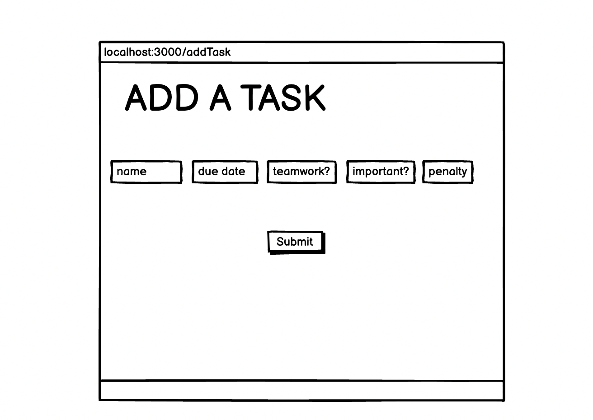
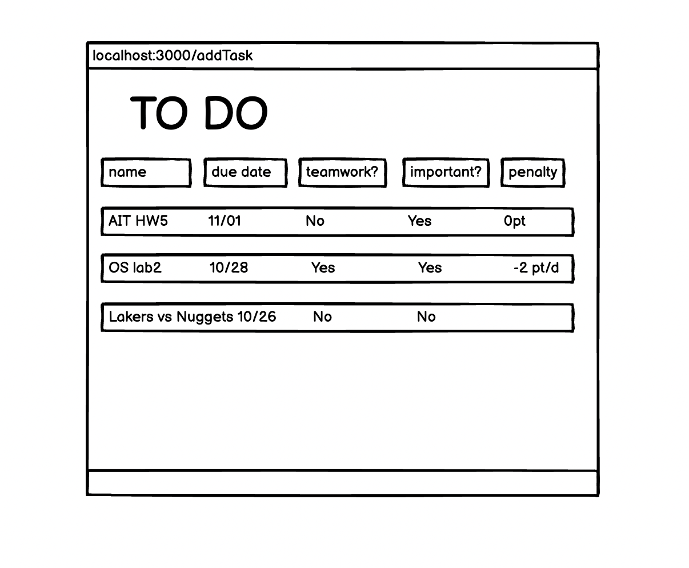
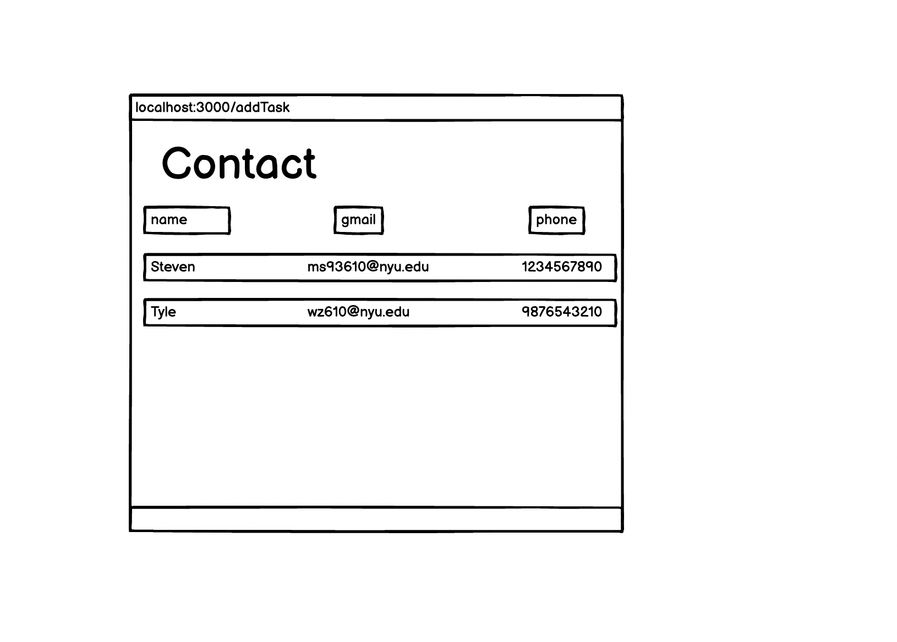

The content below is an example project proposal / requirements document. Replace the text below the lines marked "__TODO__" with details specific to your project. Remove the "TODO" lines.

TODO List express

## Overview

Remembering what to buy at the grocery store is waaaaay too difficult. Also, shopping for groceries when you're hungry leads to regrettable purchases. Sooo... that's where Shoppy Shoperson comes in!

I have been used to do list for a long time, but most of to do list do not have enough function that I am looking for. I decide to make one for myself. Later, I would perfer my TODO list express over other apps.

In my TODO list, we can keep track the progress of multiple tasks. It has a visualzation bar to show the status of the tasks. If it is a team work, we can save teammates as contracts and store their gmails and cellphone numbers in the contact. It also has an algorithm to push the task that you should do to the top.
If the task was not finished before the due date, it will ask for the penalty and if there is a last due date


## Data Model

The application will store to do list, contacts

* users can have a to do list with how important they are, status, due date, last due date, penalty, if it is a group work
* we can store their phone number and gmail in the contact


An Example User:

```javascript
{
  username: "yz6559",
  hash: // a password hash,
  lists: // an array of references to List documents
}
```

An Example List with Embedded Items:

```javascript
{
  user: // a reference to a User object
  name: "AIT HW5",
  detailed tasks: [
    { name: "part1", status: "did not start", important: true, teamWork: false, teamMates = {}},
    { name: "part2", status: "did not start", important: true, teamWork: false, teamMates = {}},
    { name: "part3", status: "did not start", important: true, teamWork: false, teamMates = {}}
  ],
  createdAt: // timestamp
}
```


## [Link to Commented First Draft Schema](db.mjs) 


## Wireframes


/list/create - page for add a new task



/list - page for showing the to do list



/list/contact - page for contact and their information



## Site map


Here's a [complex example from wikipedia](https://upload.wikimedia.org/wikipedia/commons/2/20/Sitemap_google.jpg), but you can create one without the screenshots, drop shadows, etc. ... just names of pages and where they flow to.

## [Link to Map](documentation/map.png)

## User Stories or Use Cases

(__TODO__: write out how your application will be used through [user stories](http://en.wikipedia.org/wiki/User_story#Format) and / or [use cases](https://en.wikipedia.org/wiki/Use_case))

1. as non-registered user, I can register a new account with the site
2. as a user, I can log in to the site
3. as a user, I can add new tasks
4. as a user, I can change the content of the task
5. as a user, I can add friends to my contact
6. as a user, I can change the priority of the task 

## Research Topics

(__TODO__: the research topics that you're planning on working on along with their point values... and the total points of research topics listed)

* (7 points) Integrate user authentication
    * I'm going to be using passport for user authentication
    * And account has been made for testing; I'll email you the password
    * see <code>cs.nyu.edu/~jversoza/ait-final/register</code> for register page
    * see <code>cs.nyu.edu/~jversoza/ait-final/login</code> for login page
    * design an algorithm to rank the task.
    * user also can adjust the order
* (3 points) Perform client side form validation using a JavaScript library
    * see <code>cs.nyu.edu/~jversoza/ait-final/my-form</code>
    * if you have more than 5 tasks right, you cannot add more task

10 points total out of 8 required points (___TODO__: addtional points will __not__ count for extra credit)


## [Link to Initial Main Project File](app.mjs) 

(__TODO__: create a skeleton Express application with a package.json, app.mjs, views folder, etc. ... and link to your initial app.mjs)

## Annotations / References Used


1. [passport.js authentication docs](http://passportjs.org/docs) - (add link to source code that was based on this)


